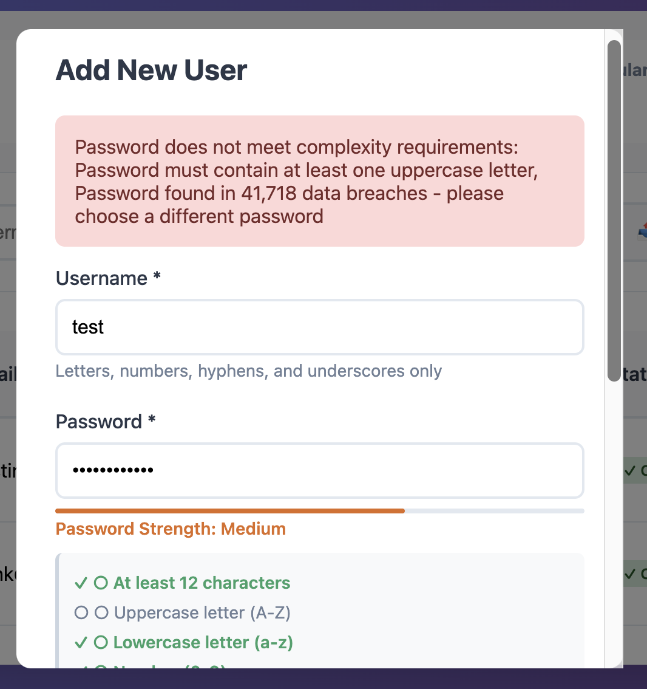

# Authelia File Admin

[](https://www.gnu.org/licenses/gpl-3.0)
[](https://github.com/dustinnh/Authelia-Admin-Panel/releases)
[](https://github.com/dustinnh/Authelia-Admin-Panel)

Production-ready web interface for managing file-based Authelia user accounts.

**The only dedicated GUI administration tool for file-based Authelia deployments.**

## Features

### Production-Ready
✅ **Gunicorn WSGI Server** - 4 workers, 60-second timeout, production-grade performance
✅ **File Locking** - Safe concurrent access to users_database.yml
✅ **Audit Logging** - HMAC-signed audit trail with tamper detection
✅ **Log Rotation** - Automatic rotation at 10MB (5 backups retained)
✅ **Rate Limiting** - Protection against abuse and brute force
✅ **Password Validation** - Configurable complexity requirements
✅ **Email Notifications** - SMTP alerts for security events (user creation, password changes, deletions)

### Security
- **CSRF Protection** - Flask-WTF token-based validation
- **XSS Prevention** - HTML escaping and input sanitization
- **Input Validation** - RFC-compliant email, username, length limits
- **Audit Integrity** - HMAC-SHA256 signatures on all audit entries
- **Password Breach Detection** - HaveIBeenPwned API integration (600M+ breaches)
- **Password History** - Prevent reuse of last 5 passwords
- **Password Expiration** - Auto-expire passwords after N days (configurable)
- **Security Headers** - HSTS, CSP, X-Frame-Options, and more
- **Email Alerts** - Real-time notifications for security events
- **No Docker Socket** - Zero host access, enhanced container isolation
- Authelia forward_auth integration
- Admin-only access control
- Self-deletion protection
- Password complexity enforcement

### User Management
- Create, read, update, delete users
- Change passwords (admin or self-service)
- Group management
- Bulk CSV import/export
- Search, filter, and sort users
- User statistics
- RFC 5321 compliant email validation
- Username format validation with length limits

## Screenshots

### User Management Dashboard
Modern interface with password age tracking and status indicators.


### Real-Time Password Validation
Interactive password strength meter, requirements checklist, and breach detection.



**Key Features Shown:**
- 🔴 **Breach Detection**: Real-time checking against HaveIBeenPwned database (600M+ breached passwords)
- 📊 **Strength Meter**: Visual feedback showing password strength (Weak/Medium/Strong)
- ✅ **Requirements Checklist**: Live validation with checkmarks as requirements are met
- 📅 **Password Age**: Days since last password change
- 🟢 **Status Badges**: Visual indicators for password health (OK/Expiring/Expired)

## Quick Start

### Docker Compose (Recommended)

```yaml
version: '3.9'

services:
  user-admin:
    build: .
    container_name: authelia-file-admin
    restart: unless-stopped
    volumes:
      - ./authelia:/config           # Authelia config directory (watch: true enables auto-reload)
      - ./logs:/var/log               # Audit logs
    environment:
      - USERS_DB_PATH=/config/users_database.yml
      - AUDIT_LOG_PATH=/var/log/authelia-admin-audit.jsonl
      - AUDIT_HMAC_KEY=${AUDIT_HMAC_KEY:-}  # Generate with: openssl rand -base64 32
      - SECRET_KEY=${SECRET_KEY:-}          # Generate with: openssl rand -base64 32
      - PASSWORD_MIN_LENGTH=12
      - PASSWORD_REQUIRE_UPPERCASE=true
      - PASSWORD_REQUIRE_LOWERCASE=true
      - PASSWORD_REQUIRE_DIGIT=true
      - PASSWORD_REQUIRE_SPECIAL=true
    networks:
      - internal

networks:
  internal:
    external: true
```

### Build and Run

```bash
# Build the image
docker build -t authelia-file-admin .

# Run the container (for testing - use Docker Compose for production)
docker run -d \
  --name authelia-file-admin \
  -v /path/to/authelia:/config \
  -v /path/to/logs:/var/log \
  -p 5000:5000 \
  -e SECRET_KEY=$(openssl rand -base64 32) \
  -e AUDIT_HMAC_KEY=$(openssl rand -base64 32) \
  authelia-file-admin
```

**Note:** Docker socket is NOT required. Authelia automatically reloads when `watch: true` is enabled in its configuration.

## Configuration

### Environment Variables

| Variable | Default | Description |
|----------|---------|-------------|
| `USERS_DB_PATH` | `/config/users_database.yml` | Path to Authelia users database |
| `AUDIT_LOG_PATH` | `/var/log/authelia-admin-audit.jsonl` | Path to audit log file |
| `AUDIT_HMAC_KEY` | (auto-generated) | HMAC secret key for audit log signing (persist across restarts!) |
| `SECRET_KEY` | (auto-generated) | Flask secret key for CSRF tokens (persist across restarts!) |
| `PASSWORD_MIN_LENGTH` | `12` | Minimum password length |
| `PASSWORD_REQUIRE_UPPERCASE` | `true` | Require uppercase letters |
| `PASSWORD_REQUIRE_LOWERCASE` | `true` | Require lowercase letters |
| `PASSWORD_REQUIRE_DIGIT` | `true` | Require digits |
| `PASSWORD_REQUIRE_SPECIAL` | `true` | Require special characters |
| `PASSWORD_CHECK_BREACH` | `true` | Check passwords against HaveIBeenPwned breach database |
| `PASSWORD_HISTORY_COUNT` | `5` | Number of previous passwords to prevent reuse (0 to disable) |
| `PASSWORD_EXPIRATION_DAYS` | `0` | Days until password expires (0 = never expire). Set to 90 for 90-day rotation. |
| `EMAIL_ENABLED` | `false` | Enable email notifications for security events |
| `SMTP_HOST` | `""` | SMTP server hostname (required if email enabled) |
| `SMTP_PORT` | `587` | SMTP server port |
| `SMTP_USERNAME` | `""` | SMTP authentication username |
| `SMTP_PASSWORD` | `""` | SMTP authentication password |
| `SMTP_FROM_EMAIL` | `noreply@authelia-admin.local` | From email address |
| `SMTP_FROM_NAME` | `Authelia Admin` | From display name |
| `SMTP_USE_TLS` | `true` | Enable TLS encryption for SMTP |
| `ADMIN_EMAIL` | `""` | Admin email address for security notifications |

**Security Note**: Generate persistent secrets with `openssl rand -base64 32` and store in environment or `.env` file.

### Caddy Integration

Add to your Caddyfile:

```caddyfile
run.example.com {
    # ... other configuration ...

    handle_path /api/admin/* {
        forward_auth authelia:9091 {
            uri /api/verify?rd=https://run.example.com/auth/
            copy_headers Remote-User Remote-Groups Remote-Name Remote-Email
        }
        reverse_proxy authelia-file-admin:5000
    }
}
```

## API Endpoints

### Authentication
All endpoints require Authelia forward_auth headers:
- `Remote-User` - Current username
- `Remote-Groups` - Comma-separated group list (must include "admins")

### Endpoints

#### GET /users
List all users (admins only)

**Response:**
```json
{
  "users": [
    {
      "username": "john",
      "displayname": "John Doe",
      "email": "john@example.com",
      "groups": ["users", "admins"]
    }
  ],
  "total": 1
}
```

#### POST /users
Create a new user (admins only)

**Request:**
```json
{
  "username": "jane",
  "password": "SecurePass123!",
  "displayname": "Jane Smith",
  "email": "jane@example.com",
  "groups": ["users"]
}
```

**Response:**
```json
{
  "message": "User created successfully",
  "username": "jane"
}
```

#### DELETE /users/{username}
Delete a user (admins only, cannot delete self)

**Response:**
```json
{
  "message": "User deleted successfully"
}
```

#### PUT /users/{username}/password
Change user password (admins or self)

**Request:**
```json
{
  "password": "NewSecurePass123!"
}
```

**Response:**
```json
{
  "message": "Password updated successfully"
}
```

#### GET /stats
Get user statistics (admins only)

**Response:**
```json
{
  "total_users": 5,
  "groups": {
    "users": 5,
    "admins": 2
  }
}
```

#### GET /health
Health check endpoint

**Response:**
```json
{
  "status": "healthy",
  "version": "1.2.0",
  "features": [
    "file_locking",
    "audit_logging",
    "audit_hmac_signing",
    "audit_log_rotation",
    "password_validation",
    "input_validation",
    "rate_limiting",
    "csrf_protection"
  ]
}
```

#### GET /audit/verify
Verify audit log integrity by checking HMAC signatures (admins only)

**Query Parameters:**
- `max_lines` (optional): Limit number of lines to check

**Response:**
```json
{
  "total": 17,
  "valid": 15,
  "invalid": 0,
  "errors": [
    {
      "line": 1,
      "error": "Missing HMAC signature (legacy entry)"
    }
  ]
}
```

## Audit Logging

All administrative actions are logged to `/var/log/authelia-admin-audit.jsonl` in JSON Lines format with HMAC-SHA256 signatures:

```json
{"timestamp": "2025-11-19T02:31:31.673488", "action": "create_user", "user": "admin", "target": "john", "details": "Groups: ['users'], Email: john@example.com", "success": true, "ip": "192.168.1.100", "hmac": "89c591a93d5bfbea9b4a9635d1b62bdca2f83b17504d6f63244dc14f887dc5a9"}
{"timestamp": "2025-11-19T02:32:15.123456", "action": "change_password", "user": "john", "target": "john", "details": "Password updated", "success": true, "ip": "192.168.1.100", "hmac": "7f3a2b8c9d1e4f5a6b7c8d9e0f1a2b3c4d5e6f7a8b9c0d1e2f3a4b5c6d7e8f9a"}
{"timestamp": "2025-11-19T02:33:00.987654", "action": "delete_user", "user": "admin", "target": "jane", "details": "User deleted", "success": true, "ip": "192.168.1.100", "hmac": "1a2b3c4d5e6f7a8b9c0d1e2f3a4b5c6d7e8f9a0b1c2d3e4f5a6b7c8d9e0f1a2b"}
```

**Features:**
- **HMAC Signing**: Every entry signed with HMAC-SHA256 for tamper detection
- **Automatic Rotation**: Logs rotate at 10MB, keeps 5 backup files
- **Integrity Verification**: Use `/audit/verify` endpoint to check for tampering

## Password Policy

Default password requirements (configurable via environment variables):
- Minimum 12 characters
- At least one uppercase letter (A-Z)
- At least one lowercase letter (a-z)
- At least one digit (0-9)
- At least one special character

## Rate Limiting

Default rate limits:
- **List users**: 30 requests per minute
- **Create user**: 10 requests per minute
- **Delete user**: 20 requests per minute
- **Change password**: 10 requests per minute
- **Global**: 200 requests per day, 50 requests per hour

## Development

### Project Structure

```
authelia-file-admin/
├── src/
│   └── app.py           # Main application
├── tests/               # Unit tests (TODO)
├── docs/                # Documentation
├── Dockerfile           # Container build
├── requirements.txt     # Python dependencies
├── PROJECT_PLAN.md      # Development roadmap
└── README.md            # This file
```

### Local Development

```bash
# Install dependencies
pip install -r requirements.txt

# Run development server (NOT for production)
python src/app.py

# Run with Gunicorn (production)
gunicorn --bind 0.0.0.0:5000 --workers 4 --timeout 60 app:app
```

### Testing

```bash
# TODO: Add unit tests
pytest tests/
```

## Deployment

### Walled Garden Integration

This tool is designed to integrate seamlessly with Authelia-based walled garden setups:

1. **Deploy** as a Docker container on the internal network
2. **Mount** Authelia's config directory as a volume
3. **Configure** Caddy to proxy `/api/admin/*` to the container
4. **Protect** with Authelia forward_auth (admins-only)

See `PROJECT_PLAN.md` for complete deployment guide.

## Roadmap

### Phase 1: MVP ✅ COMPLETED
- ✅ Production WSGI server (Gunicorn, 4 workers)
- ✅ File locking for safe concurrent access
- ✅ Comprehensive audit logging with HMAC signatures
- ✅ Password complexity validation (configurable)
- ✅ Rate limiting (Flask-Limiter)
- ✅ CSRF protection (Flask-WTF)
- ✅ Input validation & XSS prevention
- ✅ Automatic log rotation (10MB, 5 backups)
- ✅ Bulk CSV import/export
- ✅ Search, filter, and sort UI

### Phase 2: Enhanced Security & UI ✅ MOSTLY COMPLETE

**Completed Features:**
- ✅ Password breach detection (HaveIBeenPwned API, k-anonymity)
- ✅ Password history tracking (prevent reuse of last 5 passwords)
- ✅ Password expiration policies (configurable days)
- ✅ Security headers (HSTS, CSP, X-Frame-Options, etc.)
- ✅ Email notification system (SMTP with HTML templates)
- ✅ Real-time password validation UI (strength meter, requirements checklist)
- ✅ Password status indicators (expired/expiring/healthy badges)
- ✅ Password health dashboard statistics

**Pending Features:**
- ⏳ Git-backed change history with visual diff viewer
- ⏳ Webhook system for external integrations (Slack, Discord, etc.)
- ⏳ Unit test suite (pytest) with comprehensive coverage
- ⏳ API documentation (OpenAPI/Swagger specification)

### Phase 3: Advanced Features 🔮 PLANNED
- 🔮 LDAP backend support (dual backend architecture)
- 🔮 TOTP secret management UI (view/reset 2FA secrets)
- 🔮 Active session viewer (requires Authelia API integration)
- 🔮 Kubernetes Helm chart for enterprise deployments
- 🔮 Performance optimization (caching, async operations)
- 🔮 Security audit and penetration testing

See [PROJECT_PLAN.md](PROJECT_PLAN.md) for detailed development roadmap.

## Troubleshooting

### File Permission Errors

Ensure the container has write access to:
- `/config/users_database.yml` (user database)
- `/var/log/authelia-admin-audit.jsonl` (audit log)

Fix with:
```bash
chmod 644 /opt/authelia-stack/authelia/users_database.yml
chmod 755 /opt/authelia-stack/logs
```

### Authelia Not Reloading Users

Ensure Authelia configuration has file watching enabled:
```yaml
authentication_backend:
  file:
    watch: true  # Required for auto-reload
    path: /config/users_database.yml
```

### CSRF Token Errors

If you see "CSRF token is missing" errors:
1. Check that `/csrf-token` endpoint is accessible
2. Verify frontend is fetching token on page load
3. Ensure `SECRET_KEY` environment variable is set and persistent

### Audit Log Verification Failures

If `/audit/verify` shows invalid entries:
1. Check `AUDIT_HMAC_KEY` is set and hasn't changed
2. Legacy entries without HMAC will show warnings (expected)
3. Any "HMAC verification failed" indicates possible tampering

### Rate Limit Errors

Adjust rate limits via flask-limiter configuration or disable for testing:
```python
limiter = Limiter(enabled=False)  # Development only
```

## Security Considerations

### Required
- Run behind Authelia forward_auth
- Use HTTPS (via Caddy/reverse proxy)
- Restrict to internal Docker network
- Regularly review audit logs

### Recommended
- Enable strong password policies
- Limit admin group membership
- Monitor failed authentication attempts
- Regular security updates

## Contributing

Contributions are welcome! This project is actively developed and open to community input.

### How to Contribute

1. **Fork the repository** on GitHub
2. **Create a feature branch** (`git checkout -b feature/amazing-feature`)
3. **Make your changes** and test thoroughly
4. **Commit your changes** (`git commit -m 'Add amazing feature'`)
5. **Push to the branch** (`git push origin feature/amazing-feature`)
6. **Open a Pull Request** on GitHub

### Guidelines

- **Security First**: All contributions must maintain or improve security posture
- **Test Your Changes**: Ensure your changes don't break existing functionality
- **Follow Conventions**: Match existing code style (see [CLAUDE.md](../CLAUDE.md) for patterns)
- **Document**: Update README.md or add comments for significant changes
- **One Feature Per PR**: Keep pull requests focused on a single feature or fix

### Reporting Issues

Found a bug or have a feature request? [Open an issue](https://github.com/dustinnh/Authelia-Admin-Panel/issues) on GitHub.

### Code of Conduct

- Be respectful and inclusive
- Focus on constructive feedback
- Prioritize security and quality
- Help build a welcoming community

## Part of Larger Architecture

This admin panel is designed to work with **any Authelia setup**, making it perfect for standalone integration with your existing deployment.

However, if you're deploying a **complete SSO authentication gateway from scratch**, check out the comprehensive reference architecture:

### 🏰 [Authelia Walled Garden - Complete SSO Reference Architecture](https://github.com/dustinnh/Walled-Garden)

The **Walled Garden** provides a complete production-ready architecture that includes:

- ✅ **Complete Caddy + Authelia Setup** - Reverse proxy with automatic HTTPS
- ✅ **This Admin Panel Pre-Configured** - Included as the `/admin` endpoint
- ✅ **Multiple Service Integrations** - Examples for popular self-hosted services
- ✅ **Application Dashboard** - Unified launcher for all services
- ✅ **Comprehensive Documentation** - 1,900+ line deployment guide
- ✅ **Deployment Scripts** - Automated staging and production deployment
- ✅ **Reference Architecture** - Production-tested network topology

**Perfect for:**
- Deploying a complete authentication gateway from scratch
- Learning SSO architecture and best practices
- Integrating multiple services behind Authelia
- Understanding how all components work together

**This admin panel is included** in the Walled Garden as the user management component, but can also be used independently with your existing Authelia setup.

### Standalone vs. Integrated Use

**Use Standalone** if you:
- Already have Authelia running (with Nginx, Traefik, etc.)
- Just need web-based user management
- Want to add GUI admin to existing deployment

**Use Walled Garden** if you:
- Need complete SSO gateway from scratch
- Want Caddy + Authelia + services configured
- Need comprehensive deployment documentation
- Want production-ready reference architecture

Both approaches are fully supported!

## License

GNU General Public License v3.0 - See [LICENSE](LICENSE) file for details.

This program is free software: you can redistribute it and/or modify it under the terms of the GNU General Public License as published by the Free Software Foundation, either version 3 of the License, or (at your option) any later version.

## Support

- **GitHub Repository**: [https://github.com/dustinnh/Authelia-Admin-Panel](https://github.com/dustinnh/Authelia-Admin-Panel)
- **Issues & Bug Reports**: [GitHub Issues](https://github.com/dustinnh/Authelia-Admin-Panel/issues)
- **Feature Requests**: [GitHub Discussions](https://github.com/dustinnh/Authelia-Admin-Panel/discussions)
- **Email**: dustin@nycapphouse.com
- **Documentation**: See [PROJECT_PLAN.md](../PROJECT_PLAN.md) and [CLAUDE.md](../CLAUDE.md)

## Credits

**Author**: Dustin @ NYC App House
**Inspired by**: [Authelia](https://www.authelia.com/) and the need for file-based admin tools

---

**Version**: 1.10.0 - Production Ready
**Status**: Phase 2 Enhanced Security Complete | Phase 3 Planned
**License**: GPLv3
**Repository**: [https://github.com/dustinnh/Authelia-Admin-Panel](https://github.com/dustinnh/Authelia-Admin-Panel)
